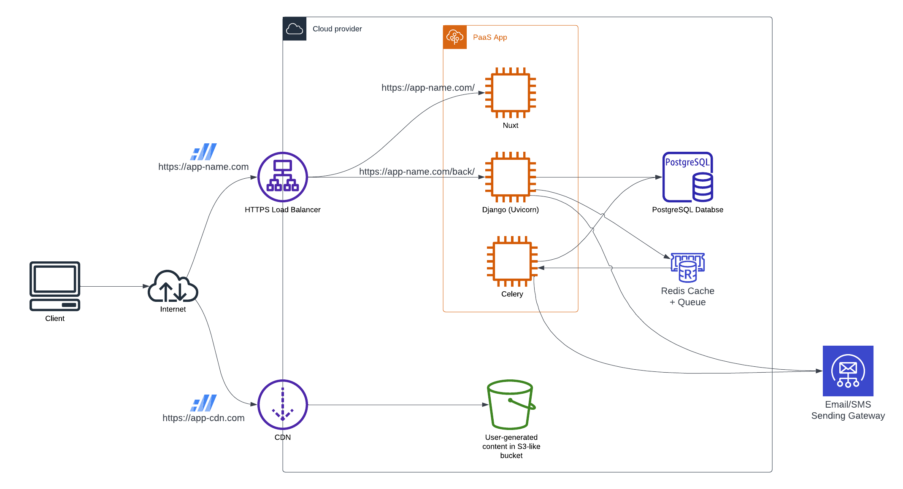

# Architecture

In the end, web applications all have the same basic needs. Of course, it needs
to be adapted for the needs of the application, however it is assumed as a
common base for all the following infrastructure.

We'll explain the rationale behind main choices here.

## Framework stack

Since the requirements explained here stem from the choice of frameworks, we'll
dive first into those.

### Back-end &mdash; Django

At the core of the core lies Django. It's a fairly old, slow and un-sexy
framework in today's world full of revolutionary async noSQL blazing-fast
world-class industry-standard frameworks. How did we land there? There are the 3
main features of Django (for our use case):

1. The ORM
2. The ORM
3. The ORM

We'll cover the choice of SQL and PostgreSQL later on, but the fact that Django
has such a powerful ORM enables several productivity boosts:

-   The ORM has a Git-friendly migrations system
    -   Most of the time, this allows for zero-downtime deployments (worst-case
        scenario, some requests fail, but if the app is well done the
        consequences are very small)
    -   The migrations can be merged between branches, allowing for teamwork and
        complex release cycles that match real-life requirements
-   It allows easy introspection of models
    -   The `admin` app can auto-generate full CRUD admin interfaces within
        minutes of work, which saved our ass so many times
    -   The Django REST Framework can lay the base of the API by simply looking
        at models (then it's up to you to add the specific behaviors you need,
        but a _lot_ of work is done automatically)

Any alternative framework should at least offer the same guarantees. So far,
none really exist as such on the market and Django is entirely satisfying, so we
stick with it.

Then it has many perks about security, abstractions for common services
(storage, emails, etc), internationalisation and localization, etc. Those are
important albeit secondary.

### Front-end &mdash; Nuxt

The underlying choice is: which JS framework to use? It wasn't always obvious,
but some of the key names are React, Vue, Angular and Svelte. Out of those, we
want to eliminate those that are not actually reactive (React) and those that
are made for "enterprise" development (Angular). This leaves us with Vue and
Svelte.

Out of those two, we need a SSR framework that will handle under the hood many
things that developers don't even realize anymore: data store, meta data of the
page, HTTP requests, etc.

For these reasons, we have chosen to use Vue and Nuxt

## Storage

Django and Nuxt both depend on external services for persistence. Those services
must come from the cloud provider, as they are a massive pain in the ass to
manage yourself. Commonly considered providers in our case include DigitalOcean,
AWS, Scaleway and OVH.

### Structured data &mdash; PostgreSQL

As explained before, we store most of structured data in a PostgreSQL database.
This is because:

-   It is extremely viable:
    -   It has a great output performance-wise. Most of the time when a NoSQL
        solution claims to be faster it is because it forgoes "slow" features of
        SQL like joints, which are absolutely essential for most applications.
        In other words, SQL storage allows you to do the same as NoSQL but comes
        with a lot more features.
    -   Clustering and scaling and so forth is pretty hard to do yourself, but
        why would we care since it's the job of the cloud provider.
    -   If a product is so successful that it brings a PostgreSQL instances to
        its knees, we'll have plenty of resources to optimize SQL queries, shard
        the data and so forth.
    -   If you need to do some NoSQL things like storing JSON, PostgreSQL has
        very powerful JSON management, allows indexing and querying of JSON and
        the query language is Turing-complete with recursive queries. You can
        query _a lot_ of things.
    -   And finally, the PostGIS extension for geographical data is available in
        all providers and is extremely powerful in managing geo queries.
-   It has fantastic support in the Django ORM

This overall makes it the best choice for structured data storage.

### Cache &mdash; Redis

Redis is very fast, very easy to manage and available in all cloud providers.
That's also a solution that is natively supported by Django, which makes it a
good choice for our stack.

### Queue &mdash; Also Redis

Natively Celery would rather use RabbitMQ, which is also a trustable piece of
software. However the availability of RabbitMQ in various cloud providers is
quite reduced.

On the other hand, Redis provides a good option and works perfectly well. So
that's what we'll go with.

### User-generated content &mdash; S3-like

Everything that is user-generated (images mostly, but also PDF documents, videos
and so forth) should be stored in a S3-like bucket. It's easy to use, there are
the right abstractions in Django and it's available everywhere.

Given also that the original S3 remains unequaled in feature-completeness, it is
a service easily bought from AWS even if the rest of the infrastructure is on a
different provider.

## External communications

The stack above will require to be able to send emails and/or SMS to clients.

In order to do so, the abstraction to be used is the
[Wailer](https://github.com/withagency/wailer) system, which provides a
higher-level abstraction than the Django email backend (or the `django-sms`
package, which it uses internally).

The goal of Wailer is to enforce patterns and best practices for sending emails
which are convenient for the developers and avoid the common bugs by asking the
right questions.

It still needs a backing service to send its messages. The recommended one for
both emails and SMSes is Mailjet. Its configuration is explained in the
[Django preset](https://modelw-django-preset.readthedocs.io/en/latest/env-vars.html#external-communications)
documentation.

## PaaS platform

It's expected that the app code will run in a PaaS platform, or at least some
kind of orchestrator like Kubernetes. There should be 3 basic services
(conceptually, in practice there are more):

-   Nuxt for the front-end
-   Django (through Uvicorn) for the back-end
-   Celery for the Django tasks

Those 3 parts are expected to be distributed as some form of images that respect
the 12&nbsp;factors and can be span as needed.

The PaaS platform should be provided by the cloud provider. To be honest, the
target here is mainly the PaaS from DigitalOcean, which is by far the simplest
one to manipulate.

## HTTP Routing

HTTP routing can be a complex topic, however our recommendation goes as follows.

There shall be two "endpoints":

-   A load balancer for all the processes of the PaaS
-   A CDN for the UGC and other content from the bucket

Both should be on separate domains for security and simplicity reasons. The
source needs to be found back but basically it was an advice from a Google
Engineering blog post. On top of that, the requirements are quite different.

The load-balancer's job will be to direct HTTP requests either to the back-end
or the front-end. The easiest way to do this is to decide that everything that
is below the `/back` path goes to the back-end while the rest goes to the
front-end. Then both receive unmodified queries and can reply to the user while
keeping it transparent for the browser. This is especially important for the
cookies, which would be hard to manage if requests weren't made to the same
domain for front and back.

This way when you request:

-   `https://my-app.com/yolo` you get the front-end page "Yolo"
-   `https://my-app.com/back/api/thing/42/` you get the "thing" with ID 42 from
    API
-   `https://my-app.com/back/api/login/` you login against the back-end and this
    cookie will be forwarded to any page within this domain
-   Meaning that if you go back to `https://my-app.com/yolo` and you render it
    server-side, it will still receive the session cookie, allowing to forward
    it to back-end requests from the frontend (which Nuxt/Axios does
    automatically)

Then for user-generated content, which is inherently static, it makes more sense
to have a CDN in front of the bucket that will cache and serve this content on
edge.

## Repo structure

The rule of thumb is that all which is shipped together should sit in the same
repo. Otherwise, you just end up doing the same conceptual commit in all the
different components of the app. Let's just acknowledge that we work with
monoliths!

At the root of the repo should be found the different components:

-   `api` &mdash; The Django backend
-   `front` &mdash; The Nuxt front-end
-   `bot` &mdash; The BERNARD project (if any)
-   Any other component that you need

### API

The API should follow the
[API template](https://github.com/ModelW/project-maker/tree/develop/src/model_w/project_maker/template/api).

Amongst many things:

-   Configuration comes 100% from environment variables
-   The project depends on the `modelw-preset-django` package at the current
    Model&#8239;W version

See [the Transform an Existing Project](./transform-project.md) section for more
details.

### Front

Same as the API, it should follow the
[front template](https://github.com/ModelW/project-maker/tree/develop/src/model_w/project_maker/template/front).

## Extra

While the stack is explained above, some peripheral tools deserve to be
mentioned below.

### Sentry

Sentry is a powerful exception reporting tool. It will let you aggregate:

-   Different exceptions with a lot of details as to which user had it, on which
    environment, how many times, etc
-   Detailed performance metrics including the list of SQL queries and their
    specific run time

Overall, that's the first tool to look into for insights about any project.
